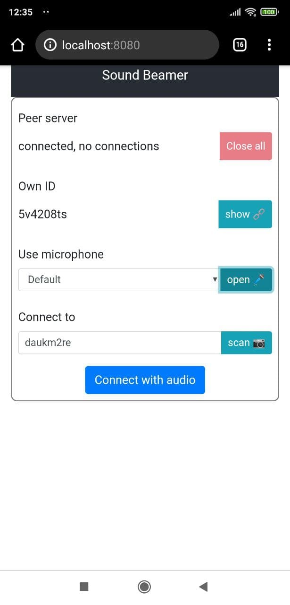
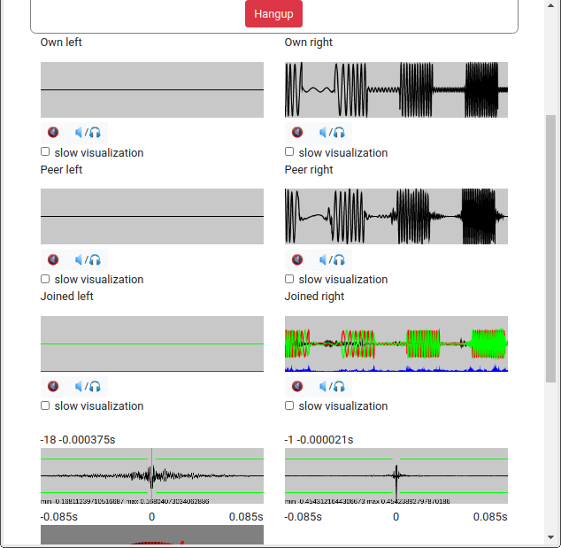
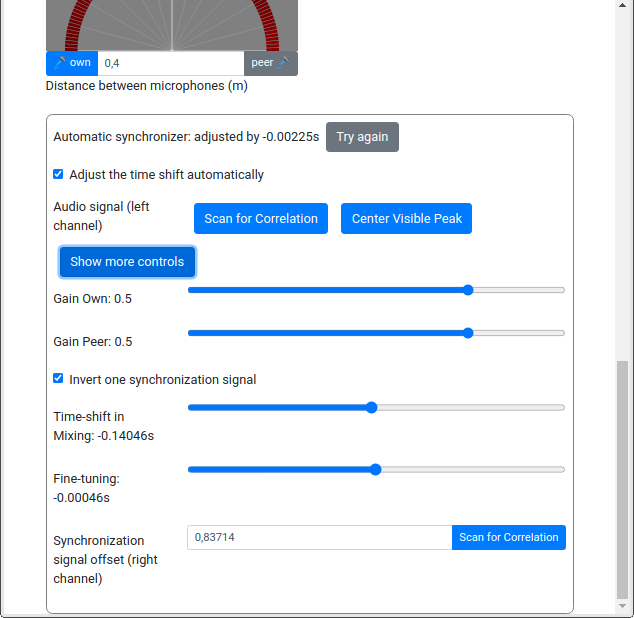

# Sound Beaming

_Experimental_

Create an audio connection between two devices (clients) in near proximity to each other, compare the audio streams and try to
calculate the direction of incoming sounds from the time difference.

Delay-and-sum [beamforming](https://en.wikipedia.org/wiki/Beamforming) using just two microphones in a distributed setting requires special care in synchronizing the two audio streams together.

This project was bootstrapped with [Create React App](https://github.com/facebook/create-react-app).

## APIs used

- [Web Audio](https://developer.mozilla.org/en-US/docs/Web/API/Web_Audio_API)

- [WebRTC](https://developer.mozilla.org/en-US/docs/Web/API/WebRTC_API) using [PeerJS](https://peerjs.com/)
  - A local [PeerServer](https://github.com/peers/peerjs-server) is used for negotiating the connections

- [Web Workers](https://developer.mozilla.org/en-US/docs/Web/API/Web_Workers_API) using [comlink-loader](https://github.com/GoogleChromeLabs/comlink-loader)
  - the project has _not_ been ejected from Create React App

## Connecting
### Secure context

For security reasons some APIs are only accessible in [secure contexts](https://developer.mozilla.org/en-US/docs/Web/Security/Secure_Contexts). The page should thus be accessed through:
- http://127.0.0.1:3000, http://localhost:3000, or http://*.localhost:3000
- file://\<path to index.html\>
- https://\<any\>

### Port forwarding

When testing on an Android device, please [forward the following ports](https://developer.chrome.com/docs/devtools/remote-debugging/local-server/):
- 3000 to localhost:3000 (web page)
- 9000 to localhost:9000 (peer server)

## Usage

Connect two devices to the running server. For testing two tabs or windows in
the same browser or two different browsers work fine as well.

Copy the ID from one client to the other one and click "Connect". You can also use "show" and "scan" to show the code as a QR code and to scan it using the other device's camera.

Clicking on various items on the screen allows visualizing and listening to individual channels from both the local and the remote client.

The left side is for the microphone audio and the right side is for the synchronization signal.

If the automatic synchronizer works as intended, it will keep the synchronization signals aligned and the right side correlation centered at zero (zero samples, zero seconds).

The left channel can be synchronized after the right channel. If the "center" and "scan for correlation" buttons don't bring the desired outcome, the extra controls can be used to experiment further.

### Algorithm

Both clients operate similarly. They generate a synchronization signal and
merge it into a stereo signal with the audio stream coming from the microphone.

The local (own) and remote (peer) signals are analyzed. First a base measurement
is performed to define the offset between the two synchronization signals.
The offset is due to the two clients not starting the signal at the exact same
time.

The offset between two audio signals is determined from the
[cross-correlation](https://en.wikipedia.org/wiki/Cross-correlation)
between them calculated using Fourier transforms.

Another base measurement is done between the _real_ audio signals (coming from
the microphones) to define the center point, or perhaps the direction from
which incoming sounds are amplified.

Occasionally the remote sound is delayed or skips by a small amount (milliseconds
or less). This is eventually detected and the delays between both the
synchronization signals as well as the real audio signals are automatically
adjusted to account for the change.

When the synchronization signals stay in sync but the time difference between
the two real audio signals (one local, one from the peer) changes, we can
assume that the sound source is moving closer to one of the microphones
and farther from the other one. From this change and knowledge of the
positions of the two microphones we can approximate the direction of the sound
in a plane.

Separating sounds coming from behind from those coming from ahead,
as well as dealing with the third dimension, would require using (or moving)
more microphones. Sound reflections, monotone and repeating signals, and
unexplained drift in the system make the results less useful than what
they could be.

### Compatibility

The code has been tested on Firefox (desktop only) and on Chrome (desktop
  and Android). Connection should work also between Firefox and Chrome
  clients, but in practice there appear to be difficulties in synchronizing
  the two clients in such cases.

## Known Issues

- Synchronization between Firefox and Chrome is usually not working
- Sometimes the automatic synchronizer fails to record sounds on Chromium
    ("audio/wav -> 46.0 Bytes" in the console); reloading the page should fix it

---

## Available Scripts

In the project directory, you can run:

### `yarn start`

Runs the app in the development mode.\
Open [http://localhost:3000](http://localhost:3000) to view it in the browser.

The page will reload if you make edits.\
You will also see any lint errors in the console.

### `yarn test`

Launches the test runner in the interactive watch mode.\
See the section about [running tests](https://facebook.github.io/create-react-app/docs/running-tests) for more information.

### `yarn build`

Builds the app for production to the `build` folder.\
It correctly bundles React in production mode and optimizes the build for the best performance.

The build is minified and the filenames include the hashes.\
Your app is ready to be deployed!

See the section about [deployment](https://facebook.github.io/create-react-app/docs/deployment) for more information.

### `yarn eject`

**Note: this is a one-way operation. Once you `eject`, you can’t go back!**

If you aren’t satisfied with the build tool and configuration choices, you can `eject` at any time. This command will remove the single build dependency from your project.

Instead, it will copy all the configuration files and the transitive dependencies (webpack, Babel, ESLint, etc) right into your project so you have full control over them. All of the commands except `eject` will still work, but they will point to the copied scripts so you can tweak them. At this point you’re on your own.

You don’t have to ever use `eject`. The curated feature set is suitable for small and middle deployments, and you shouldn’t feel obligated to use this feature. However we understand that this tool wouldn’t be useful if you couldn’t customize it when you are ready for it.
